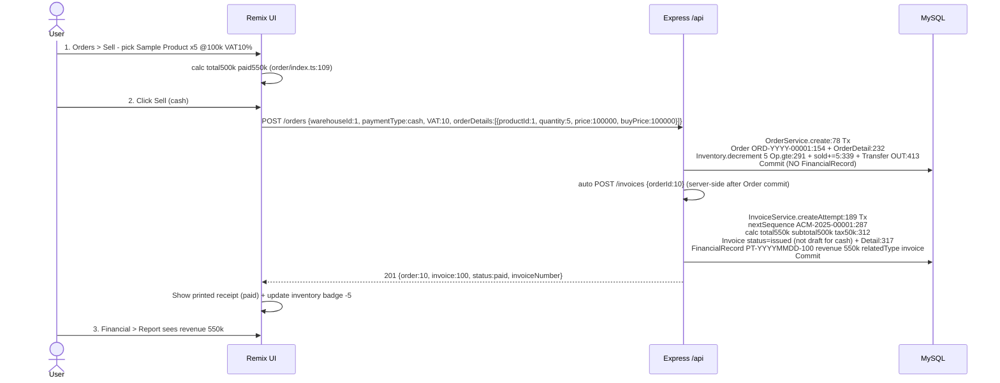
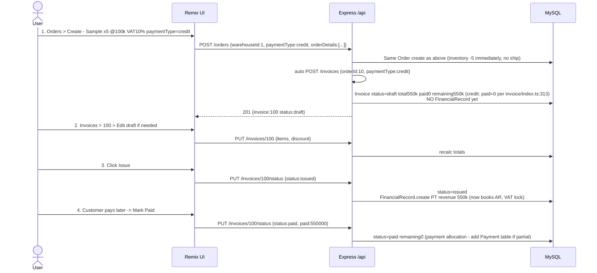

# Inventory Management - Correct Order & Invoice Flow

> Focus: Inventory Management. `Ship Now` / Delivery step is intentionally omitted - inventory is decremented on `Order` confirmation.
> This document fixes current behavior where `OrderService.create` books ledger immediately and `Invoice.paid` is isolated.

---

## 1. Current File Map

| Layer | File | Role |
|---|---|---|
| Model Order | `backend-ts/src/database/models/order.ts:20` | `code, VAT, paid, surcharge, price, paymentType, providerId, warehouseId, vendorId` - **no `status` column** |
| Model Invoice | `backend-ts/src/database/models/invoice.ts:62` | `status: draft\|issued\|paid\|cancelled`, `subtotal, discount, VAT, taxAmount, surcharge, total, paid, remaining` |
| Service Order | `backend-ts/src/services/order/index.ts:78` | `create` does `Order + OrderDetail + Inventory.decrement:291 + Product.sold++:339 + Transfer:413 + FinancialRecord PT/PC:443` in one `Tx` |
| Service Invoice | `backend-ts/src/services/invoice/index.ts:189` | `createAttempt` requires `orderId:210`, derives `items` from `orderDetails:259`, generates `VEN-YYYY-00001` via atomic `nextSequence:287` inside `Tx` + retry `ER_DUP_ENTRY:178`, calculates `subtotal/tax/total:312` |
| Service Financial | `backend-ts/src/services/financial/index.ts:126` | `getReport` sums `financial_records` + `orders.price*VAT` - **ignores `invoices`** |
| Router Order | `backend-ts/src/routers/orders` | `POST /orders`, `GET /orders?warehouseId&isProvider`, `GET /orders/:id` |
| Router Invoice | `backend-ts/src/routers/invoice/index.ts:6` | `GET /invoices`, `GET /invoices/:id`, `POST /invoices`, `PUT /invoices/:id`, `PUT /invoices/:id/status`, `DELETE /invoices/:id` |
| UI List Invoices | `client/app/routes/_index+/invoices+/index.tsx:31` | Filters `s/status`, actions `view/edit/delete/markPaid` (delete shown for all - bug vs `delete:532` `draft` only) |
| UI Add Invoice | `client/app/routes/_index+/invoices+/add/index.tsx:19` | Picker lists `orderService.getOrders`, `POST /invoices {orderId, status:"draft"}:46` -> `navigate /invoices/:id` |
| UI Detail Invoice | `client/app/routes/_index+/invoices+/$id+/index.tsx:23` | Shows `ReceiptPrinter`, `draft->Edit:150`, `issued->Mark as Paid:157`, prints via `printReceiptToDevice` |
| UI Edit Invoice | `client/app/routes/_index+/invoices+/$id+/edit.tsx:51` | Edits `customerId/items/discount/surcharge/paymentType` via `PUT /invoices/:id:383` - no `status` control |

---

## 2. Why Other Platforms Don't Auto-Invoice on `Order.create`

`Order` is a *promise*, `Invoice` is the *legal financial truth*:

| Reason | This Repo (`Order IS Invoice`) | Standard (Odoo/SAP/Zoho/KiotViet) |
|---|---|---|
| Revenue recognition (accrual) | `Order.create:173` books `PT/PC-YYYYMMDD-id` `revenue/expense` before goods conceptually delivered - overstates profit | `Invoice.posted` on `Order.confirmed` creates `AR debit / Revenue credit`, VAT on invoice date only |
| Inventory timing | `decrement` on `Order:233` - quotation blocks stock | `Order.confirmed` reserves, `Delivery.done` decrements - allows `10/20` partial ship, backorder |
| Legal numbering | `VEN-YYYY-00001` on `Order` would gap on cancel/edit | `draft` has placeholder, `posted` consumes number - `nextSequence:31` + `ER_DUP_ENTRY` retry `178` safe only at `issued` |
| Edit/Cancel | `Order.update` delta `527` must reverse `Inventory:537` + `FinancialRecord:601` manually; `Invoice` guard `Op.ne cancelled:245` enforces `1:1` | `draft` freely editable, `posted` immutable - reversal via credit note, preserves audit `transfers.quantity type 0/1` |
| Payment | No `Payment` table, `paid/remaining BIGINT:50` single overwrite `updateStatus:555` | N `Payment`s allocate `remaining`, `dueDate:65` credit terms, dunning |
| Cardinality | `1 Order : 1 non-cancelled Invoice:245` | `1:N` (installments) or `N:1` (consolidated) via `order.invoiceStatus = to_invoice/invoiced` |

**POS exception:** `paymentType=cash` immediate `paid=total:313` auto-invoice is correct for POS - same as this repo. `credit/transfer` is never auto-invoiced.

---

## 3. Invoice Lifecycle `draft -> paid (=completed)`

> No `completed` value exists - `InvoiceStatus = draft | issued | paid | cancelled` (`types/invoice.ts:7`, `models/invoice.ts:62`).

```
Order (confirmed)
  │
  │ POST /invoices {orderId, status:"draft"} add/index.tsx:46
  ▼
draft ── PUT /invoices/:id {items,...} edit.tsx:40 (editable)
  │     DELETE /invoices/:id allowed only here delete:532
  │     GAP TODAY: no UI to issue - must call PUT /invoices/:id/status {status:"issued"} manually
  ▼
issued ── PUT /invoices/:id/status {status:"paid"} detail/index.tsx:61 / list:index.tsx:111
  │       (requireAdmin) remaining=0 updateStatus:555
  ▼
paid (terminal, only print ReceiptPrinter:171)
  │
cancelled (exists as enum + filter index.tsx:156, no UI, no reversal logic)
```

Bugs: `List` shows `Edit/Delete` for all `index.tsx:237,242` vs `Detail` hides unless `draft:150` + backend `draft` guard `503:519`; `updateStatus:553` accepts any `status` string with no state-machine validation.

---

## 4. Correct Flow - Sample Product x5 - No Ship

### 4.1 Why 9 Steps Is Confusing (and When Needed)

Previous 9-step `draft -> edit -> issued -> paid` exists to satisfy `ERP` requirements: `VAT` lock, `legal gap` `nextSequence:287`, `credit/transfer` `dueDate:65`, `partial/reverse` `Order.update delta:527`. For `inventory + ship not needed + 90% cash` POS it is overkill.

**Solution: Collapse for `cash`, keep full for `credit`.** Progressive disclosure - `cash` auto-completes, `credit` shows manual steps.

### 4.2 Simplified Correct Flow

#### Cash / Transfer Immediate (Default - 2 clicks)



> One `UI` action = `2 API` calls chained server-side (or `UI` does `await POST /orders` then `await POST /invoices`). No `draft/edit/issued/paid` buttons for `cash`.

#### Credit / Pay Later (Full - when needed)



Collapsed `cash` hides `draft/edit/issued/paid` UI behind `1 Sell button`; `credit` exposes them via `Details` tabs `Draft (editable)` vs `Posted`.

### 4.3 DB Effects Per Step (Simplified)

| Step | `inventories` | `transfers` | `financial_records` | `invoices` |
|---|---|---|---|---|
| `POST /orders` cash/credit | `-5` atomic `Op.gte:295` | `1 OUT` | **0** (deferred) | 0 |
| `POST /invoices` cash (auto) | 0 | 0 | `PT revenue 550k` | `issued/paid` `total550k` `nextSequence:287` |
| `POST /invoices` credit (auto) | 0 | 0 | 0 | `draft` `paid0 remaining550k` |
| `PUT status issued` (credit only) | 0 | 0 | `PT revenue 550k` (VAT lock) | `issued` |
| `PUT status paid` (credit) | 0 | 0 | 0 (or `Payment` row if partial) | `paid` `remaining0` |
| Cancel `Invoice draft` | 0 | 0 | 0 | `DELETE 532` allowed only `draft` |
| Cancel `Order` before `issued` | `+5` reverse `Order.update:527` | `0 IN` reverse | 0 | delete `draft` invoice |

### 4.4 Changes Required From Current Implementation

1.  **Move ledger:** Remove `Order.createFinancialVoucher:173` from `services/order/index.ts:171` -> create `FinancialRecord` inside `InvoiceService.createAttempt:189` when `paymentType=cash` (set `status=issued` immediately) OR inside `updateStatus:537` when `status==='issued'` for `credit` - same `Tx` as `nextSequence:287`.
2.  **Auto-chain for cash:** After `Order.create:185 commit`, server auto `POST /invoices {orderId}` (or UI chains `await invoiceService.createInvoice`) with `status = paymentType==='cash' ? 'issued' : 'draft'`. Removes manual `invoices/add/index.tsx:19` picker for `cash` flow. Keep picker only for `Fix Invoice` edge case.
3.  **Hide steps in UI:** `invoices+/$id+/index.tsx:150` only show `Issue` when `status===draft && paymentType!==cash`; `invoices+/index.tsx:242` hide `Edit/Delete` unless `draft`; `List` default filter hides `paid` pre-issue noise.
4.  **Report source:** `FinancialService.getReport:126` switch from `orders` to `financial_records where relatedType='invoice'` so `cash` auto-issued `PT` is counted.

### 4.5 Why This Is Correct for Inventory Management (and Simple)

*   `Order` = inventory truth (`-5:291` immediate - no ship), `Invoice` = financial truth (`revenue` on `issued`, not `Order`) - audit correct but `cash` user sees `1 Sell -> printed paid receipt`.
*   `draft` only surfaced for `credit` where `dueDate:65` + correction needed before `VAT` lock; satisfies VN gap rule without confusing `cash` sellers.
*   `N Orders -> 1 Invoice` later possible if `orderId` nullable - current guard `1:1:245` relaxed only for `credit` consolidation.
